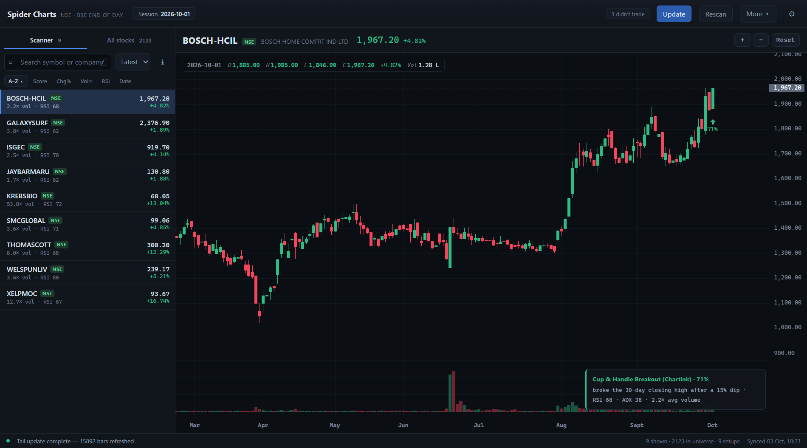
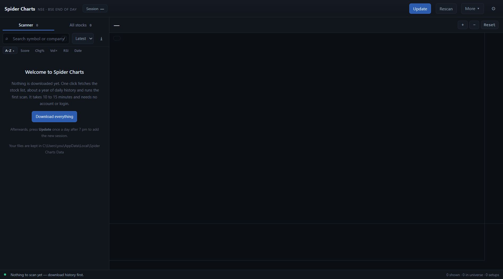
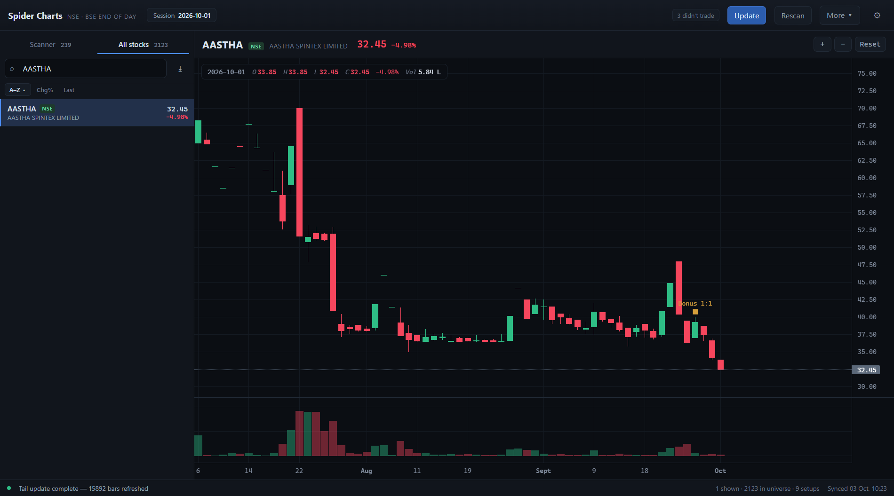

# Spider Charts

**A free Windows app that shows end-of-day charts of Indian stocks (NSE and BSE) and lists the ones that have just broken out to a new high after a dip.**

Made by Aniruddhsinh Parmar. Free and open source ([MIT licence](LICENSE)). Windows 10 and 11.

Everything runs on your own PC. **No account, no login, no API key, no subscription.** The app itself sends nothing about you anywhere; it only downloads public market data.



*You do not need to know anything about programming to use it. Programmers: there is a section for you at the bottom, under [For developers](#for-developers-and-the-curious).*

---

## Who it is for

Anyone who looks at stocks **once a day, after the market closes**, and wants a quick list of what is moving, instead of opening hundreds of charts by hand. It has no live prices and no intraday charts, on purpose: it is for overnight and positional decisions only.

It is a tool for looking, not advice. It does not tell you what to buy or sell.

## What you get

- **About 2,100 stocks**, almost all on NSE, in alphabetical order, each with a chart. Move through them with the arrow keys. Only stocks with a market value above 100 crore rupees are included, taken from a list of **12 August 2026**; see [Limits](#limits-you-should-know).
- **A "Scanner" tab** showing only the stocks that pass one fixed checklist ([explained below](#what-the-scanner-looks-for)).
- **Clean charts.** Candles, volume, and room to the right of the last candle. No indicators to set up.
- **Prices corrected for splits and bonuses** on NSE-listed stocks, so a 1:1 bonus does not look like a 50% crash. A small amber marker says what happened.
- **A one-click export** of whatever list you are looking at, as a spreadsheet file that opens in Excel.

---

## Install it

**Before you start.** You need a **Windows 10 or 11** PC and an internet connection. Almost every laptop sold in the last ten years is 64-bit, which is what it needs; to check, open *Start*, *Settings*, *System*, *About*, and look for "64-bit operating system". The installer is about **5 MB**. The app and its data take about **100 MB** of disk, and the first download uses roughly **50 MB** of internet data. In all, plan on **about 20 minutes**, most of it waiting.

**Step 1. Download the installer.**
Open the [latest release](https://github.com/anirudhparmar68-quant/aniruddhsinhji-charts/releases/latest). Scroll down to the word **Assets** and click the one file whose name starts with **Spider-Charts** and ends with **x64-setup.exe**. Ignore the other files, and ignore the green **Code** button. Your browser may say the file "isn't commonly downloaded"; choose **Keep**.

**Step 2. Run it.**
Double-click the downloaded file. Windows will probably show a blue box saying **"Windows protected your PC"**. Windows shows it for any program from a small independent maker that it does not know yet, and this one is not signed with a paid certificate. It does not mean the file is a virus, and nothing has been installed at this point. Click the small link **More info**, then the **Run anyway** button that appears.

If you would rather not run an unsigned program, that is a fair choice: stop here, or build it yourself from the source code (see the end of this page). The release page shows a SHA-256 checksum for the file, for anyone who wants to check that it is unchanged.

A small setup window opens. Click **Next** and **Install**. On the last page you can tick **Create desktop shortcut** and **Run Spider Charts**, then click **Finish**. It installs for your Windows user only and does not need an administrator password.

**Step 3. Open Spider Charts from the Start menu and press "Download everything".**
The first time, the app is empty. In the panel on the left, press only the big blue **Download everything** button (ignore the buttons at the top for now). It fetches the list of stocks and about a year of daily prices, checks NSE for splits and bonuses, and runs the first scan. It takes **10 to 15 minutes** and needs **no login**.



While it runs, the bar at the very bottom shows what it is doing, for example "Downloading daily history for 2151 stocks", with a progress bar and a count that climbs, such as 450 / 2151. Keep the laptop plugged in and do not let it sleep or close the lid. You can minimise the window and use other programs. It is finished when the status at the bottom says **"Sync complete"** and the list on the left fills with stocks. If the count has not moved for five minutes, close the app and open it again. If the list is partly filled, an amber bar offers **Continue download**; if the screen is empty again, press **Download everything** again. Either way it carries on: stocks that were already downloaded only need a short top-up.

**Step 4. Press "Update" on each trading day, after about 7 pm.**
That adds the day's prices. It usually takes under a minute; about once a week it takes up to three minutes, because it also re-checks NSE for splits and bonuses. Use it Monday to Friday, once the exchanges have published the day's file (usually by the evening). When it finishes, the bottom bar says "Tail update complete" followed by a number of bars. That number is not the number of new days, and it is large even when nothing new arrived, so to see whether new prices came in, look at the **Session** date at the top. On weekends and market holidays the Session date does not change, which is normal. If you miss a few days, one press catches up on them. If you miss more than about a week, press **More ▾** then **Download history** once to fill the gap.

**To check that you are up to date,** look at the **Session** date at the top: it should be the last trading day.

**To remove it later.** Open *Start*, *Settings*, *Apps*, find **Spider Charts** and choose **Uninstall**. That leaves your downloaded data behind, and the uninstaller's "Delete the application data" box does not remove it either. To delete it, press the Windows key and R together, type `%LOCALAPPDATA%` and press Enter, and delete the folder called **Spider Charts Data**. (Inside the app, **More ▾** then **Open data folder** opens that same folder.)

---

## Using it every day

| What you press | What it does |
|---|---|
| **Update** | Adds the newest trading day's prices. Once a day, after about 7 pm. |
| **Rescan** | Re-runs the checklist on what you already have. |
| **More ▾** | The less common things: re-download history, open the data folder, and so on. |
| **⚙** | Settings. The defaults are fine to start with. |
| **↑ ↓ ← →** | Go to the previous or next stock. The chart follows at once. |
| **/** | Jump to the search box. Type a name or symbol. |
| **⭳** (next to search) | Saves the list you are looking at as `scanner_export.csv` or `universe_export.csv`, in the folder called **data** inside your data folder (**More ▾**, **Open data folder**, then open **data**). The bottom bar shows the full path for a few seconds. It opens in Excel, and each export replaces the last. |

The two tabs at the top of the list:

- **Scanner** shows only the stocks that pass the checklist. The drop-down next to the search box picks how far back to look: **Latest** (the newest session only), **3D** (3 days), **1W** (a week), **1M** (a month) or **All**. The number on the tab is for the window you picked. The list is in alphabetical order; click **Date**, above the list, to see the newest first, or **Score** to see the strongest first.
- **All stocks** is the whole list, alphabetical.

**What you see on a chart.**

- An **arrow with a percentage** marks a day the stock passed the checklist. The percentage is a ranking number, not a chance of success: see [below](#what-the-scanner-looks-for).
- A **small amber square** marks a split or bonus. It means the older prices on that chart were corrected, so the price does not appear to crash on that day.
- A **grey square** marks a demerger or rights issue. Their price drop cannot be corrected, so it is left in and only pointed out. Treat any scanner result with a grey square in the last three months as suspect.
- The pill at the top that says something like **"3 didn't trade"** counts stocks with no price on the newest day. That is normal for thinly traded stocks, not an error.

---

## What the Scanner looks for

The scan is modelled on a "cup and handle breakout" scan from the Chartink screener. Despite the name, **it does not look for a cup or a handle shape.** It is a checklist of numbers. A stock is listed on the day **all** of these are true:

1. Its close is **above the highest close of the previous 30 trading days**, and yesterday's close was not (so it is listed only on the day it breaks out, not again the next day).
2. The **lowest close of the last 20 trading days is at least 15% below the highest close of the last 60 trading days**. This is the "dip". The low does not have to come after the high, so a stock that simply rallied about 18% in a month can pass.
3. Its close is **above its 50-day average**.
4. Its **5-day average volume is above its 50-day average volume**, and **today's volume is more than 1.5 times its 20-day average**.
5. **RSI (14 days) is above 55** and **ADX (14 days) is above 20**. RSI measures momentum and ADX measures how strong a trend is.

Every number above can be changed under ⚙ if you know what you are doing.

The percentage on the arrow starts at 60% for passing everything, and adds up to 40 points for a deeper dip, heavier volume and a stronger trend. **It is not a probability, and the scan has not been tested against how stocks moved afterwards.** Being on the list means a stock passed the checklist today, nothing more.

---

## Limits you should know

- **End of day only.** No live prices, no intraday charts.
- **The stock list is a snapshot.** It is the author's list of stocks above 100 crore rupees on 12 August 2026, built into the program, so it only changes when a new version of the app comes out. Stocks that have grown past 100 crore since, and new listings, are missing; stocks that have shrunk since are still in it. A stock needs about three months of history before it can appear in the Scanner.
- **Splits and bonuses are corrected on NSE-listed stocks only.** Nearly everything in the built-in list is NSE-listed, so almost all of it is covered. **Demergers and rights issues are not corrected**, and the scan counts such a drop as a dip for about three months. Dividends are not adjusted. Corrections already downloaded keep working if NSE cannot be reached, but stocks it could not be asked about are left uncorrected and show no amber marker, so a missing marker does not prove nothing happened.
- **Prices on the charts are corrected prices.** They will not match an unadjusted chart from your broker, which shows the real price on each day.
- **Update re-reads about the last ten days.** A longer gap needs **More ▾** then **Download history**.
- **The data comes from free public sources** (Upstox's public price service, and the exchanges' own files) with no promise attached. Prices can be late or wrong.
- **No liquidity test** beyond the 100 crore size and a minimum price of ₹5. Some stocks in the list barely trade, and their charts show it.

---

## Questions

**Do I need an Upstox account, a broker account, or an API key?**
No. You do not need an account with any broker. The app downloads public data that needs no login: the stock list and price history from Upstox's public service, the daily files that NSE and BSE publish, and NSE's own list of splits and bonuses. If you do happen to have Upstox API keys there is an optional place to use them (see *For developers*), but you never have to.

**Is it free? Is it safe? Does it send my data anywhere?**
It is free, and anyone technical can read exactly what it does, on this page. The program only downloads public market data and uploads nothing about you or your PC. (Like any website, the servers it downloads from can see your internet address.) Your files stay on your PC, in `%LOCALAPPDATA%\Spider Charts Data`, which you can delete at any time.

**Why do some charts have an amber or grey square?**
That is a corporate event: a bonus issue or split (amber, and the older prices were corrected to match) or a demerger or rights issue (grey, not corrected). Without the correction, the day a company gives one bonus share for every share held, its price halves and a plain chart shows a 50% crash that never cost anyone anything.



**Can I add my own stocks, or refresh the list?**
Only by replacing the list file by hand. It is `%LOCALAPPDATA%\Spider Charts Data\data\universe_symbols.csv`, and one column headed `symbol` is enough. After replacing it, press **More ▾**, **Download history** (to fetch any new stocks) and then **Rescan**. The app never refreshes the list by itself.

**Why does the first download take so long, and why only once?**
It fetches a year of prices for about 2,100 stocks, politely, a few at a time. After that, each Update only adds the newest days.

**Can I use it on a Mac or Linux?**
Not as an installer. The installer is for Windows 10 and 11. People who build programs from source code may be able to build it elsewhere, but that is not tested.

**Is this financial advice?**
No. It shows public data and a mechanical checklist. Decide for yourself, and talk to a SEBI-registered adviser if you need advice.

---

## If something goes wrong

- **The installer says "Windows protected your PC".** Click **More info**, then **Run anyway**. See step 2.
- **Your antivirus blocks the installer.** Unsigned programs are often flagged. If you do not want to override it, do not; building from source is the alternative.
- **The app flashes and closes, or opens a blank white window.** Your PC is probably missing a free Microsoft component called WebView2. Open [Microsoft's WebView2 page](https://developer.microsoft.com/microsoft-edge/webview2/), download the **Evergreen Bootstrapper**, run it, and open Spider Charts again. (The installer normally installs it for you if you are online.)
- **"Download everything" stops, or the bar at the bottom shows an error.** Your internet probably dropped. Open the app again; an amber bar says *Download did not finish* with a **Continue download** button (or the welcome screen returns, with **Download everything**). Either one carries on, and stocks already downloaded only need a short top-up.
- **After Update, nothing seems new.** Check the **Session** date at the top. The exchanges publish the day's file in the evening, and not at all on weekends and holidays, so the Session date only moves after that. Try again after 7 pm on a trading day.
- **Something else.** If you have a free GitHub account, open an [issue](https://github.com/anirudhparmar68-quant/aniruddhsinhji-charts/issues) and say what you pressed and what you saw. Otherwise, ask the person who sent you the link.

## Words you will see

- **NSE / BSE**: India's two big stock exchanges.
- **End of day**: one price record per trading day (open, high, low, close, volume), not live prices.
- **Session**: one trading day.
- **Bhavcopy**: the daily file each exchange publishes after the close with every stock's prices. The app reads it for the newest days.
- **Universe**: the list of stocks the app covers.
- **Setup** (or **match**): a stock that passes the checklist on a given day. The list badges and the footer call these "setups".
- **Split / bonus**: a company increases its number of shares, so each share is worth proportionally less. The company is not worth less; only the price per share is.
- **Demerger**: a company separates a part of itself into a new company. The price drops by roughly that part's value, and shareholders get shares of the new company.
- **Rights issue**: existing shareholders are offered new shares, usually at a discount.
- **Corrected (adjusted)**: older prices rescaled so that a split or bonus leaves no cliff in the chart.

---
---

# For developers and the curious

Everything above is the whole story for someone who just wants to use the app. What follows is how it works, how to build it, and the decisions behind it.

A self-hosted, end-of-day charting and scanning desktop app for NSE + BSE
equities. Rust engine, local SQLite, no server, no account, nothing leaves the
machine.

Built for **overnight/positional** work only — there is no intraday mode by design.

Two front ends sit on one engine:

| | | |
|---|---|---|
| **`spider-ui`** | Tauri + React desktop app | the one to use |
| **`spider_charts`** | the original egui app | still builds, kept as a fallback |
| **`spider_charts --tail`** | headless nightly update | what Task Scheduler runs |

All three read the same `data/spider.db`, and only one may write at a time —
see *Two processes, one database* below.

---

## Run it from the source code

For someone who has cloned the repository instead of downloading the installer.
You need:

- **Git**.
- **Rust**, from [rustup.rs](https://rustup.rs). When it offers the Visual Studio
  C++ Build Tools, accept, and tick **"Desktop development with C++"**; without that
  the build fails with `link.exe not found`. It is several GB and takes 10 to 20
  minutes. Use the current stable Rust (rustup installs it), and open a new terminal
  afterwards.
- **Node.js 20.19 or newer, or 22.12 or newer** (21.x and early 22.x are too old for
  the build tool).
- Microsoft **WebView2**, which Windows 11 already has.

You do **not** need an Upstox account. Run the commands below in **Command Prompt or
Git Bash**; in PowerShell, `npm` can be blocked by the script-execution policy.

```bash
git clone https://github.com/anirudhparmar68-quant/aniruddhsinhji-charts.git
```

```bash
cd aniruddhsinhji-charts
```

```bash
npm install --prefix spider-ui
```

```bash
npm run tauri dev --prefix spider-ui
```

The first run compiles several hundred Rust crates and takes roughly 5 to 15 minutes
(an estimate, not a measurement). The terminal can sit on a "Compiling ..." line for a
long while without being stuck. Later runs start in seconds. The Spider Charts window
opens by itself when the build finishes and stays only as long as the terminal does;
port 1420 must be free, because the development server uses it. The window is empty at
first, so press **Download everything**, exactly as in the installed copy. The data goes
into a `data/` folder inside the checkout, which Git ignores.

The headless program used below (`--tail`, `--sync`, `--check-universe`) is a separate
binary that `tauri dev` does not build. From a checkout, run it as
`cargo run --release -- --tail`, or build it once with
`cargo build --release -p spider_charts` and run `target\release\spider_charts.exe --tail`.
`Run.bat` is a shortcut: with no argument it installs the web part if needed, builds the
release desktop app once, and after that just launches it; `--old`, `--tail` and `--sync`
run the egui app and the two headless jobs.

---

## What it does

- **Universe** — driven by **your own screener export**, `data/universe_symbols.csv`.
  Drop in the result of a "Market Cap > 100 cr" screen and that is the universe;
  the exchange-tier and ISIN rules below then decide which listing of each name
  to use. Listed **alphabetically**. Currently **2,124** stocks are in the
  universe (2,122 NSE and 2 BSE) out of the 2,161 symbols in the list. The rest
  were dropped by the ₹5 price floor, the 30-session history minimum, or are not
  in Upstox's instrument dump at all (8 symbols on the 29 Sep 2026 dump).
  Delete the file and the app falls back to the market-cap and turnover rules. A
  brand-new install is given a built-in copy of the author's list (see *Install
  it* and *Limits you should know* above), so nobody needs a screener account to
  start.
- **Data** — daily OHLCV in SQLite, from two sources on purpose: **Upstox** for
  building history, and the exchanges' own **NSE + BSE bhavcopy** for the recent
  tail. See below for why. Bhavcopy is raw, and Upstox's history is corrected for
  many splits and bonuses but not all, so a third, small source, **NSE's own MCP
  service**, supplies the splits and bonuses to correct the rest with (see
  *Splits, bonuses and other corporate actions*).
- **The scan** — exactly one: **your Chartink "cup and handle breakout"**, ported
  condition for condition (see below). It runs over the whole universe on every
  update.

  > Two larger families were built, tested, and then **removed on request**: 75
  > candlestick recognisers, and 24 geometric chart structures (cups, double and
  > triple tops/bottoms, head and shoulders, triangles, wedges, flags, pennants,
  > Darvas boxes, rounding bottoms, VCP, base breakouts). Both are the kind of
  > pattern where "did it really form?" is a matter of opinion. They live in git
  > history, so bringing any of them back is a revert away.
- **Scanner** — the universe-wide list of what fired, opening on **the latest
  candle**, because that is the question this tool exists to answer. It sits
  beside the chart, not in front of it, and the arrow keys walk it.
- **Chart** — candlesticks with a volume pane, scroll-to-zoom, drag-to-pan, a
  free-moving crosshair with a floating OHLC readout, and a marker on the bar the
  scan fired on. Space is always kept to the right of the newest candle.

### The thing it does that a screener does not

A Chartink scan gives you a list. This gives you the list *and* the chart at the
same time, over your own 100 cr+ universe, from data you hold on disk — so
checking twenty names is twenty keypresses, not twenty page loads.

---

## Running it

The desktop app (the one to use):

```bash
npm run tauri dev --prefix spider-ui
```

To produce a standalone `.exe` and an installer:

```bash
npm run tauri build --prefix spider-ui
```

The old egui app still builds, unchanged:

```bash
cargo run --release
```

**Where `data/` lives.** The first of these that applies:

1. the folder named by the `SPIDER_HOME` environment variable;
2. the exe's own folder, if it already holds a `data/` folder or a `.env` (a
   portable copy: unzip it anywhere and it keeps its data beside it);
3. this source checkout, when the exe was built inside it (`cargo run`,
   `tauri dev`, the nightly job under `target\release`);
4. `%LOCALAPPDATA%\Spider Charts Data`, which is what an installed copy uses.

Rule 3 used to be the only fallback, and it pointed at the folder the program was
*compiled* in, so an installer built on one PC looked for that path on every other.

### The desktop app

Two panes, always both on screen: the list on the left, its chart on the right.

- **Scanner** tab lists what the scan fired on, one line per stock, over a
  window you choose (latest session, 3 days, a week, a month, everything).
- **All stocks** tab is the full universe, alphabetically, with a `Setup` badge
  on the ones that fired.

| Key | |
|---|---|
| `↑` `↓` `←` `→` | previous / next stock — the chart follows immediately |
| `PgUp` `PgDn` | jump ten |
| `Home` `End` | first / last |
| `/` or `Ctrl+K` | focus search (while you type, `↑` and `↓` still walk the list; `←` and `→` move the text cursor) |
| `Esc` | clear search |

Zoom with the wheel or the `+` / `−` buttons, drag to pan, `Reset` returns to the
newest candles. There are deliberately **no drawing tools, no indicator menu and
no timeframe switcher** — this is an end-of-day breakout list, and everything
that is not price, volume or the signal was left out.

The splitter between the panes drags, and the sort strip above the list doubles
as its column legend: `A–Z` (the default, as asked for from the start), `Score`,
`Chg%`, `Vol×`, `RSI`, `Date`. Click an active one again to flip the direction.
Ties always fall back to the alphabet so a refresh never reshuffles the list
under you.

**⭳** writes what is listed — same tab, same filter, same sort — to
`data/scanner_export.csv` or `data/universe_export.csv`, replacing the last export.
Numbers go out unformatted, so the file is arithmetic rather than text that looks
like it.

**Update** is the one thing needed day to day; it needs no login (it takes the newest
sessions from the exchanges' bhavcopy and checks NSE's list of splits and bonuses).
The rest of what touches the network sits under **More**: full sync, universe
refresh, history download, Upstox login.

### First data load

**Upstox keys are optional.** Upstox serves daily candles to anonymous callers, so
**Full sync** (or **Download everything** on an empty install) works with no account.
If you do have an Upstox API app, copy `.env.example` to `.env` (next to the `data/`
folder; for an installed copy that is `%LOCALAPPDATA%\Spider Charts Data`) and fill in
the key and secret. `UPSTOX_REDIRECT_URI` must match the redirect URI registered on
that app exactly. With keys present the history download uses your token, exactly as
before, and opens a browser to renew it when it has expired. `.env` is git-ignored so
it is never committed; with keys present they are sent to Upstox, and only to Upstox, to
log in.

Press **Full sync**. That does, in order:
   - Upstox login, only if `.env` has keys (opens a browser once per day; the token is
     cached until 03:30 IST)
   - instrument master download for NSE + BSE
   - the universe decision (your export, or market cap and turnover)
   - daily history for every qualifying stock
   - the last 10 calendar days (about 7 sessions) re-taken from bhavcopy, which
     repairs any bad bars
   - a check of NSE's list of splits and bonuses (see *Splits, bonuses and other
     corporate actions*)
   - a scan over everything

The first backfill downloads the symbols in the built-in list that Upstox knows,
about 2,150 (2,151 when measured on 3 Oct 2026, in about nine minutes, with no login).
Without a list it would be about 2,700. A later Full sync or History re-requests every
stock with a short window, so it is quicker but still takes minutes; the daily Update
is the quick one.

---

## Checking the universe without logging in

```bash
spider_charts.exe --check-universe
```

Downloads the instrument master — public, so no access token is involved and
nothing touches your broker account — then prints how many stocks were found,
how many matched the export, and how many clear the floor. Useful for
sanity-checking the filter before committing to a full backfill.

---

## Nightly automation

The same engine runs headless. The one for a scheduled job is

```bash
spider_charts.exe --tail
```

which takes the newest sessions from the exchanges' bhavcopy and needs no login
and no Upstox keys. (`--sync` is the full sync, which builds history from scratch.)
Point Windows Task Scheduler at it with a trigger at logon and another around
19:30 IST, so a PC that was off at 19:30 still catches up when it is next switched
on. Release builds are a windowed app with no console, so a scheduled run would
otherwise be silent: every line is appended to **`data/sync.log`** as well, which
is what you want for an unattended job anyway.

Build `spider_charts.exe` (`cargo build --release -p spider_charts`) at the same
time as the desktop app. They share a lock file, and a lock taken by a build from
before the Windows-lock change is not recognised by one from after it.

It exits when the scan finishes, so the app is ready with fresh results the
moment you open it. Opening the app also re-scans what is already on disk, so
the scanner is never empty on launch.

---

## How the universe is built

**Exchange tier comes first**, because it does most of the work for free.

NSE reports an instrument type, so its cash equities are simply the
`EQ`, `BE` and `BZ` types. **BSE does not** — it reports its *group code* in the
same field, which means the obvious NSE rule silently drops every BSE row. The
groups matter a great deal. Measured against a live dump of 4,835 BSE
equity-series scrips:

| BSE group | Count | Not also on NSE |
|---|---:|---:|
| A (mainboard) | 697 | **1** |
| B (mainboard) | 1,372 | **80** |
| T, X, XT, Z, M, MT, MS, P, TS, ZP | 2,766 | 2,766 |

Group A is 99.9% dual-listed and B is 94%, while the surveillance, illiquid and
SME tiers are *entirely* BSE-only — which is exactly where the untradeable
scrips live. So BSE contributes only **81 names** the NSE list does not already
have, and taking groups A+B avoids the other 2,766 without needing any
market-cap data at all. Adjust `bse_groups` in settings if you want more.

A second filter separates a company's shares from its own bonds: BSE lists both
in the same cash segment, and its debt rows (6,522 in group F, 1,125 in G)
outnumber its equities. Indian ISINs encode the security type in characters 8–9
— `01` is an equity share, `07`/`08`/`09` are debt — so that is what the app tests.

### Market cap

There is no dependable free bulk source keyed by symbol. AMFI's categorisation
page has moved and returns 404; BSE's per-scrip API carries EPS, P/E and face
value but not market cap. Rather than ship something that quietly breaks, the app
is explicit about it:

- Drop a screener export into **`data/mcap_overrides.csv`** and the ₹ floor
  applies on the next universe refresh, **but only when there is no
  `data/universe_symbols.csv`**: while that list exists (every install gets one) it decides
  membership and these rules are only a fallback. A `symbol` column plus any
  market-cap column is enough —
  ISIN is optional, extra columns are ignored, `#` lines are comments. Running
  a "Market Cap > 100" screen and pasting the result is the whole job.
- Set `mcap_source_url` in settings if you find a page hosting a bulk workbook;
  the app scrapes it for the first market-cap `.xls`/`.xlsx` link so a versioned
  filename keeps working.

Anything unresolved is **not silently dropped**. It is kept with an unknown
market cap and judged on **median daily traded value** (default ₹0.25 crore/day)
plus a ₹5 minimum price. The egui app's top bar shows how many names took that path.

Run `--check-universe` at any time to see exactly where the numbers stand.

---

## Splits, bonuses and other corporate actions

**The problem.** The prices are raw in places. The day a company issues a 1:1 bonus the
price halves overnight, and nothing in the data says why. In the author's stored
history (about 15 months), 18 stocks in the universe had a one-day fall of 35% or more, and NSE's own
records explain most of them: 5 were bonus issues, 8 were demergers or a rights
issue, and 5 had no event on NSE's list (some of those may simply have been real
crashes). On a chart each is a cliff, and the cup scan counts it as a deep dip.

**The source.** NSE runs its own MCP service
([nseindia.com/nse-mcp](https://www.nseindia.com/nse-mcp)), open without login or key,
at `https://mcp.nseindia.in/bhavcopy/cm/mcp`. Its `get_corporate_actions` tool
returns, per symbol, each event's ex-date and an `adjustmentFactor` to multiply the
earlier prices by: `0.5` for a 1:1 bonus, `0.3333` for 2:1, `0.1` for a 1:10 split.
The app speaks the protocol directly (`src/corp.rs`, JSON-RPC over HTTP), with no MCP
library.

NSE describes the data as informational and educational, and not for commercial use
or for training AI. This app is free, and each copy asks NSE itself for the few
thousand small answers it needs; nothing from NSE is redistributed.

**What the app does with it**, in the order it happens:

1. **Which stocks it asks about.** Every NSE stock in the universe that NSE has not
   been asked about in the last 7 days (the first time that is about 2,100 questions,
   which took 90 seconds, four at a time, and then once a week), plus any stock whose
   close moved 10% down or 50% up between two sessions in the last 14 days, which is
   how a new split or bonus shows itself within a day (usually a dozen stocks). The
   weekly pass is what finds the milder events, such as a 1:10 bonus, which is only a
   9% fall. Answers are stored in two small tables, `corp_actions` and `corp_checked`,
   and are only ever added to: an empty or partial answer from NSE never erases what
   is already stored.
2. **The prices in the database are never changed.** The correction is applied in
   memory every time the data is loaded, so it is repeatable and can be switched off
   (*Correct old prices for splits and bonuses* in Settings, or
   `adjust_corporate_actions` in `data/settings.json`; switching reloads the data).
3. **Bars before an ex-date** have their prices multiplied by the factor and their
   volume divided by it, so the shape of the chart is kept and the cliff goes. Several
   events compound, and two on the same day are judged together.
4. **An event is applied only if the data shows the jump it describes.** The move
   across the ex-date must be nearer to the factor than to "nothing happened". A
   mis-dated event, or a series that is already corrected, is skipped instead of being
   corrected twice.
5. **Demergers and rights issues are flagged, not adjusted.** NSE gives no factor for
   them (it reports `1.0`), and guessing a ratio would be inventing data. They get a
   grey marker on the chart when the price really did jump on the ex-date.

**A patchwork to know about.** Upstox's history comes already corrected for many
splits and bonuses, while the last ten or so days are re-taken from the exchanges'
bhavcopy, which never is. A bonus whose ex-date falls in that recent stretch leaves two
jumps: the cliff at the ex-date, and an upward step a few bars earlier where Upstox's
corrected bars end and the raw bars begin. Correcting everything before the ex-date
would then halve a year of already-correct history a second time. So for a large factor
(a 1:1 bonus or bigger) the app looks up to twelve bars back for that step and corrects
only the raw bars after it. A real example is in the tests: AASTHA, a 1:1 bonus on
28 Sep 2026. For milder factors such a step cannot be told from an ordinary +10% day, so
none is looked for and the whole earlier history is treated as raw.

When a top-up download finds that Upstox has corrected a stock's history since it was
stored (the overlapping day differs by more than 10%), that stock's whole history is
downloaded again, so the stored bars never sit half on one footing and half on another.

**How it did on real data.** On a copy of the author's database (Upstox history of
12 Aug 2026 plus bhavcopy since), all five bonus cliffs went: the worst one-day fall in
VRLLOG went from -50% to -6%, GOODLUCK from -66% to -10%, PGIL from -50% to -10%, AASTHA
from -46% to -20% and UEL from -65% to -5%. 27 demergers or rights issues were flagged
instead (eight of them behind a one-day fall of 35% or more), and the correction changed
the scan by one setup out of 3,148 (one setup that the cliff had been hiding). On a fresh
install, where Upstox has already corrected most events, only 2 stocks needed correcting,
and 24 were flagged.

**What it deliberately does not do.** Dividends are not adjusted. Splits and bonuses
are, and so is any other NSE action that comes with a factor (a consolidation, say,
labelled "Adjustment" on the chart). BSE-only stocks are not covered because NSE's
service is NSE only; the built-in list has only a couple. A stock NSE cannot resolve comes back with no events and is treated as
having none. NSE's service passes the symbol on without encoding it, so a symbol with
an ampersand (`M&M`) is sent as `M%26M`. An event whose ex-date in NSE's list does not
match the date of the cliff in the data (FISCHER's 1:10 split is the example) is not
applied, because there is no jump where NSE says there should be one.

**If NSE is unreachable** the corrections already downloaded keep being applied, and
the stocks it could not be asked about stay raw, as they were before this existed. The lookup never fails a sync: after six failed attempts in a row the service
is treated as down and left alone for that run (so a hung service costs about a minute,
not a quarter of an hour), the final status line says so, and whatever was not asked
about is asked next time.

Tests: `cargo test -p spider_charts corp::` covers the arithmetic, the patchwork case
and parsing. One test talks to NSE for real and is skipped unless asked:
`cargo test -p spider_charts live_nse -- --ignored`.

---

## The one chart pattern that stayed

**`Cup & Handle Breakout (Chartink)`** — the seven conditions of a Chartink scan, ported
one for one (it has never been compared against Chartink's live output, which uses its
own data and indicator smoothing):

```text
Close crossed above Max(30, 1 day ago Close)     fresh 30-day closing-high breakout
Min(20, Close)  <  Max(60, Close) × 0.85         at least a 15% dip in the recent past
Close           >  Sma(Close, 50)
Sma(Volume, 5)  >  Sma(Volume, 50)
Rsi(14)         >  55
Adx(14)         >  20
Volume          >  1.5 × Sma(Volume, 20)
```

Worth being clear about: it does **not** test cup shape at all — no roundness, no
handle, no rim symmetry. It is a momentum base-breakout checklist. That is a
feature, not a flaw, and it is precisely why this one survived: it sidesteps the
subjectivity of cup geometry by using conditions nobody can argue about.

Every threshold in that block is tunable — they live under `patterns` in
`data/settings.json`, so tightening the scan does not need a rebuild.

One detail worth keeping: *crossed above* is implemented as "above today **and
not** above yesterday", not merely "is above". A stock that broke out a week ago
and has held the level is not a fresh breakout, and treating it as one would fill
the list with names whose move already happened.

---

## Settings

Tunables persist to `data/settings.json`. Both apps have a Settings screen for
them (the **⚙** button in the desktop app), or edit the file:

| Setting | Default | Notes |
|---|---|---|
| Minimum market cap | ₹100 cr | Applied after a universe refresh |
| Keep unresolved market caps | on | Falls back to the turnover test |
| Minimum median turnover | ₹0.25 cr/day | Only used for unresolved names |
| Minimum price | ₹5 | Penny-stock guard |
| History to keep | 400 days | ~1 trading year plus buffer for pattern warm-up |
| Parallel downloads | 8 | How many requests may be in flight |
| Requests per second | 4 | **Global** rate cap — see below |
| Minimum pattern score | 0.5 | Every match scores at least 0.60, so this does nothing below that; raise it above 0.60 to keep only the stronger breakouts |
| Correct old prices for splits and bonuses | on | See *Splits, bonuses and other corporate actions* (`adjust_corporate_actions` in the file) |

`scan_lookback` is still in `settings.json` and is read by nothing — the scan
covers every stored bar. It is deliberately not offered as a control: a knob
that turns nothing is worse than no knob. It stays in the file so an existing
config keeps parsing, and so it is not silently reused for something else.

In the desktop app they live behind the **⚙** button, and the scan block is laid
out as the Chartink scan itself — the numbers are editable in place inside the
conditions they belong to, because a field called "depth ratio" means nothing on
its own while `Min(20, Close) < Max(60, Close) × 0.85` explains itself.

Saving always persists and hands the worker its new copy. It offers **Save and
rescan** only when something that changes detection actually changed; a download
setting does nothing until the next sync, and rescanning for it would be thirty
wasted seconds.

### About the old Today tab

The egui app has a third tab that rolls the newest candle up per stock, with
bull/bear counts and a conviction score. With exactly one pattern in the
catalogue — and that pattern always bullish — every one of those columns is a
constant: bull is always 1, bear always 0, conviction always a fixed multiple of
the score. It was not ported as a separate tab because it would have been the
Scanner tab with three columns that never vary. **Scanner + "Latest" is the
Today tab**, and it carries the price context the roll-up existed to show.

If a second pattern family is ever added back, the roll-up earns its place again
and the conviction code in `sync.rs` is still there, untouched.

### Why the newest session comes from bhavcopy, not Upstox

Upstox is fine for bulk history and useless for the tail. Measured on RELIANCE,
within the same minute, against the same endpoint:

| window requested | newest bar returned |
|---|---|
| 5 days | 07 Aug ❌ |
| 10 days | 10 Aug ✅ |
| 30 days | 10 Aug ✅ |
| 400 days | 07 Aug ❌ |

It is not deterministic and not per-instrument — a 45-day window returned the
newest bar for INFY and a stale one for four other stocks in the same sweep. The
practical effect was ugly: a sync would report *"2161 downloaded, 0 failed"* while
1,368 stocks silently sat a session behind, and every "latest candle" view then
quietly excluded them.

So the newest sessions are taken from the exchanges instead. A bhavcopy is one
file per exchange per session covering every scrip that traded — nothing to
cache wrong, no rate limit, no per-symbol requests — and both NSE and BSE publish
the same UDiFF layout carrying **ISIN**, which is exactly what this app keys
instruments on, so matching is exact rather than by name.

Every backfill therefore ends by re-taking the last 10 calendar days from
bhavcopy and upserting them, which also repairs any bad bars written earlier. A
row whose `TradDt` does not match the session being requested is rejected, so a
mislabelled or cached file cannot be written under the wrong date.

What this does **not** fix: running a sync before the exchange has published.
Run it after **19:00 IST**. If anything is still behind, the toolbar says
an `N didn't trade` pill and the status "N of M stocks did not trade on DATE" rather than pretending everything is current.

### Why there is a rate cap as well as a concurrency limit

Upstox enforces per-second, per-minute **and per-30-minute** quotas. Bounded
concurrency only respects the first of those: 2,161 requests will blow through a
per-30-minute quota no matter how few run at a time. The first build learned this
the hard way — it downloaded 505 stocks, got throttled, and then failed the
remaining 1,656 in seconds because its retry budget was about five seconds
against a thirty-minute window. Worse, it still reported "Sync complete".

Now every request passes a global pacer, makes up to six attempts with backoff out to
two minutes, honours `Retry-After`, treats Cloudflare's 403 as throttling rather
than as failure, and slows the *whole fleet* when the server pushes back. And a
sync that leaves anything behind says so, with the count and what to do about it.

### Two processes, one database

The nightly job fires at 19:30 whether or not a window is open, so the app and
the scheduled task running together is the normal case, not a rare race. When
they first did, both stalled: each held part of what the other needed and both
sat at zero CPU until one was killed.

SQLite's own busy handling does not solve this. It serialises *statements*, while
a backfill or a scan is thousands of transactions that together mean "I am
rewriting the database". `data/writer.lock` expresses that larger unit: whoever
holds it is the writer, and a process that cannot get it says so rather than forcing
its way in. On Windows the holder keeps the file open with no sharing, so when a
copy is closed or killed mid-download the OS releases it and the next one takes over
at once. (Elsewhere a lock file untouched for 30 minutes is treated as abandoned.)
Build the app and the headless binary together: a lock taken by a build from before
this change is not recognised as held by a build from after it.

Reading is never blocked, so opening the app during a sync is always safe.

> The history window is 400 calendar days rather than 365 so that a full year of
> *trading* sessions is always available, and the scan has its 60-bar look-back and
> indicator warm-up to work with.

---

## Layout

```
src/                       the engine — a library, so both front ends share it
  lib.rs                   what the front ends may use
  config.rs                paths, .env secrets, persisted settings
  model.rs                 Candle / Instrument / Exchange + candle geometry
  corp.rs                  splits, bonuses and other corporate actions (NSE's MCP service)
  ta.rs                    SMA, RSI, ADX, true range and window helpers
  store.rs                 SQLite schema and queries
  universe.rs              the allowlist and the inclusion rules
  bhavcopy.rs              NSE + BSE daily files, the authoritative tail
  writelock.rs             one writer at a time, across processes
  sync.rs                  background worker: login → universe → backfill → scan
  upstox/
    auth.rs                OAuth, local redirect catcher, token cache
    instruments.rs         instrument master, ETF filtering, ISIN de-duplication
    history.rs             V3 daily candles with retry/backoff
  patterns/
    types.rs               the pattern catalogue
    scans.rs               the Chartink cup-breakout port
  main.rs, ui/             the egui app — the only part not in the library

spider-ui/                 the Tauri + React desktop app
  src/
    api.ts                 typed wrapper over the Rust commands
    App.tsx                split view, list, keyboard navigation
    ChartPane.tsx          the chart, on lightweight-charts
    SettingsSheet.tsx      the ⚙ screen
    styles.css             the theme
    dev/fixtures.ts        synthetic data for `npm run dev` in a browser
  src-tauri/src/lib.rs     the bridge: engine types → JSON, commands → worker
```

The bridge holds no rules of its own. Anything about what a pattern *is*, or
which stock belongs in the universe, stays in the engine where it is
unit-tested and shared with the headless job.

Run the whole test suite with:

```bash
cargo test --workspace
```

Plain `cargo test` runs only the engine's tests, and also compiles the old egui
front end, which is a second long build the first time. `--workspace` adds the
desktop app's bridge tests.

The scan is tested against synthetic series (it fires on a clean breakout and not
without the dip, the volume or the trend), and the corporate-action arithmetic is
tested on real numbers, including the AASTHA patchwork case described above.
